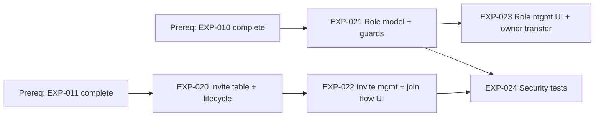

# Sprint 3 Roadmap — EXP-020..024 (Invites & Roles)

**Date:** 2026-03-10  
**Scope:** `EXP-020`, `EXP-021`, `EXP-022`, `EXP-023`, `EXP-024`

## 1) Dependency Graph (blocking vs parallel)

**Parallelizable tracks after prerequisites are met:**
- Track R (roles): `EXP-021` → `EXP-023`
- Track I (invites): `EXP-020` → `EXP-022`
- Track T (security tests): starts once `EXP-021` and `EXP-022` are testable

## 2) Critical Path

**Critical path:** `EXP-020` → `EXP-022` → `EXP-024`  
Reason: `EXP-024` is P0 exit criteria and cannot finish until invite flow is fully implemented and secured.

**Secondary path (must complete for full sprint scope):** `EXP-021` → `EXP-023`

## 3) Assignment Plan (2–4 engineers)

## Recommended baseline (3 engineers)

| Engineer | Primary Ownership | Secondary/Support |
|---|---|---|
| E1 (BE) | `EXP-020` | Pair with E2 on invite API contracts for `EXP-022` |
| E2 (BE) | `EXP-021` | Support owner-transfer backend for `EXP-023` |
| E3 (FE/QA) | `EXP-022`, `EXP-024` | Implement `EXP-023` UI once role APIs stabilize |

## If only 2 engineers

| Engineer | Ownership |
|---|---|
| E1 (BE) | `EXP-020`, `EXP-021` |
| E2 (FE/QA) | `EXP-022`, `EXP-023`, `EXP-024` |

Note: de-scope `EXP-023` to minimal owner transfer UX if schedule slips.

## If 4 engineers

| Engineer | Ownership |
|---|---|
| E1 (BE) | `EXP-020` |
| E2 (BE) | `EXP-021` |
| E3 (FE) | `EXP-022` |
| E4 (FE/QA) | `EXP-023`, `EXP-024` |

## 4) Decision Gates & Risk Checkpoints

| Day | Gate | Go/No-Go Criteria | Risk if Fails | Immediate Action |
|---|---|---|---|---|
| D2 | Schema/API Gate | `EXP-020` + `EXP-021` contracts agreed and merged | FE blocked; rework risk | Freeze payloads/errors for sprint |
| D4 | Invite E2E Gate | `EXP-022` happy path works in dev (create invite → join) | Critical path delay | Reassign BE support to unblock UI/API mismatch |
| D6 | Security Gate | Core abuse cases pass (`reused token`, `expired token`, `role escalation`) | Exit criteria risk | Shift capacity to `EXP-024`; trim `EXP-023` polish |
| D8 | Release Candidate Gate | All P0 items functionally complete (`020/021/022/024`) | Hard schedule risk | Feature-freeze and bug-only mode |
| D10 | Sprint Exit Gate | Invite join + permission matrix pass automated checks | Sprint goal miss | Carry only `EXP-023` remainder to next sprint |

## 5) 10-Working-Day Schedule

| Day | Plan | Output |
|---|---|---|
| 1 | Kickoff, finalize contracts, split tracks | Task breakdown + acceptance checklist |
| 2 | Build `EXP-020` + `EXP-021` core backend | Initial reducers/guards PRs |
| 3 | Complete backend edge handling + tests-in-dev | Backend APIs stable for FE |
| 4 | Start/continue `EXP-022` UI integration | Invite create/join happy path |
| 5 | Harden `EXP-022`; begin `EXP-023` backend hooks | Invite flow near feature-complete |
| 6 | Implement `EXP-024` high-risk security tests | First security test pass report |
| 7 | Build/finish `EXP-023` UI + owner transfer checks | Role management end-to-end |
| 8 | RC stabilization for all P0 items | Bug list burned down |
| 9 | Regression + permission matrix verification | Release notes + known issues |
| 10 | Sprint signoff + handoff decisions | Closed P0 scope, carryover only if needed |

## Execution Rules (to keep schedule)

- Prioritize P0 completion order: `EXP-020`, `EXP-021`, `EXP-022`, `EXP-024`.
- Treat `EXP-023` as controlled flex scope if any critical-path slip occurs.
- No API contract changes after D2 without explicit owner + FE signoff.