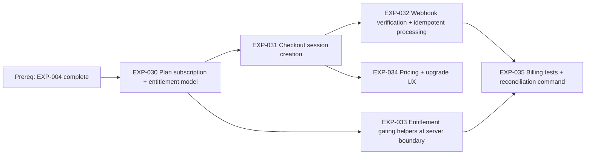

# Sprint 4 Roadmap — EXP-030..035 (Billing & Entitlements)

**Date:** 2026-03-10  
**Scope:** `EXP-030`, `EXP-031`, `EXP-032`, `EXP-033`, `EXP-034`, `EXP-035`

## 1) Dependency Graph (blocking vs parallel)

**Parallelizable tracks once `EXP-030` lands:**
- Track C (commerce path): `EXP-031` → `EXP-032`
- Track G (gating path): `EXP-033`
- Track U (client path): `EXP-034` can start after stable checkout contract from `EXP-031`
- Track Q (quality path): `EXP-035` starts when `EXP-032` and `EXP-033` are integration-testable

## 2) Critical Path & Bottlenecks

**Critical path (for sprint exit):** `EXP-030` → `EXP-031` → `EXP-032` → `EXP-035`

**Why:** paid activation correctness depends on webhook-driven state transitions and reconciliation coverage.

**Key bottlenecks:**
- `EXP-030` schema/API delay blocks 3 downstream items (`031`, `033`, then `032/035` indirectly).
- `EXP-032` is the highest risk (signature verification, retries, idempotency, replay ordering).
- External dependency risk: payment provider sandbox/webhook reliability can stall validation late sprint.

## 3) Assignment Model (2–4 engineers)

## Recommended baseline (3 engineers)

| Engineer | Primary Ownership | Secondary/Support |
|---|---|---|
| E1 (BE) | `EXP-030`, `EXP-033` | Support reconciliation logic in `EXP-035` |
| E2 (BE/OPS) | `EXP-031`, `EXP-032` | Own webhook env + secret/config hygiene |
| E3 (FE/QA) | `EXP-034`, `EXP-035` | Pair on checkout UX contract + e2e billing scenarios |

## If only 2 engineers

| Engineer | Ownership |
|---|---|
| E1 (BE/OPS) | `EXP-030`, `EXP-031`, `EXP-032` |
| E2 (FE/QA) | `EXP-033`, `EXP-034`, `EXP-035` |

**Scope control:** keep `EXP-034` to essential upgrade CTA and plan comparison only.

## If 4 engineers

| Engineer | Ownership |
|---|---|
| E1 (BE) | `EXP-030` |
| E2 (BE/OPS) | `EXP-031`, `EXP-032` |
| E3 (BE) | `EXP-033`, `EXP-035` reconciliation command |
| E4 (FE/QA) | `EXP-034`, `EXP-035` billing scenarios |

## 4) Decision Gates & Risk Checkpoints

| Day | Gate | Go/No-Go Criteria | Risk if Fails | Immediate Action |
|---|---|---|---|---|
| D2 | Data Contract Gate | `EXP-030` merged; subscription/entitlement queries stable | All downstream tracks blocked | Freeze schema + API payloads for sprint |
| D4 | Checkout Gate | `EXP-031` creates sessions and returns success/cancel paths | `EXP-032`/`EXP-034` blocked | Reassign one BE to unblock integration contract |
| D6 | Webhook Safety Gate | `EXP-032` passes signature + idempotency + replay checks | Corrupt billing state risk | Enter bugfix-only mode on webhook path |
| D8 | Enforcement Gate | `EXP-033` limits enforced server-side; `EXP-034` upgrade UX wired | Free-tier abuse or broken upsell UX | Cut non-essential UI polish, focus enforcement |
| D10 | Exit Gate | `EXP-035` covers past_due/canceled/replay; reconciliation works | Sprint goal miss | Carry only non-P0 enhancements to Sprint 5 |

**Gate checklist (must stay green):**
- [ ] Billing state transitions are idempotent.
- [ ] Entitlements are enforced at server boundary (not client-only).
- [ ] Upgrade path is functional end-to-end from block state.
- [ ] Reconciliation command detects and repairs drift safely.

## 5) 10-Working-Day Schedule

| Day | Plan | Output |
|---|---|---|
| 1 | Sprint kickoff, finalize billing domain contracts, test matrix | Task split + acceptance checklist |
| 2 | Build/merge `EXP-030` model + query surface | Stable schema + domain API |
| 3 | Implement `EXP-031` checkout creation flow | Checkout session happy path |
| 4 | Continue `EXP-031`; begin `EXP-034` UI wiring | Upgrade CTA triggers checkout |
| 5 | Implement `EXP-032` webhook verification/idempotency core | Webhook ingest works in sandbox |
| 6 | Harden `EXP-032` edge cases; start `EXP-033` enforcement rollout | Replay-safe state updates + partial gating |
| 7 | Complete `EXP-033`; start `EXP-035` tests + reconciliation command | Server limits fully enforced |
| 8 | Expand `EXP-035` scenarios (past_due/canceled/replay) + stabilization | Billing regression report |
| 9 | RC hardening, bug burn-down, release readiness checks | Candidate release + known issues list |
| 10 | Sprint signoff against exit criteria, carryover cutline | Closed P0 scope + Sprint 5 carryover list |

**Daily control checklist:**
- [ ] No contract-breaking API changes after D2 without explicit signoff.
- [ ] Critical-path items reviewed within 24h of PR open.
- [ ] Webhook and reconciliation paths tested with replayed fixtures.
- [ ] Any slip on `EXP-032` triggers immediate de-scope of non-P0 polish.
