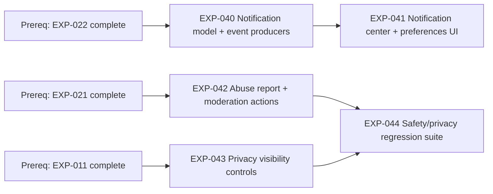

# Sprint 5 Roadmap — EXP-040..044 (Notifications + Trust/Privacy)

**Date:** 2026-03-10  
**Scope:** `EXP-040`, `EXP-041`, `EXP-042`, `EXP-043`, `EXP-044`

## 1) Dependency Graph (blocking vs parallel)

**Parallelizable tracks after prerequisites are met:**
- Track N (notifications): `EXP-040` → `EXP-041`
- Track S (safety): `EXP-042`
- Track P (privacy): `EXP-043`
- Track Q (quality): `EXP-044` starts once `EXP-042` and `EXP-043` are integration-testable

## 2) Critical Path & Bottlenecks

**Critical path (for sprint exit):** `EXP-042` → `EXP-044`

**Why:** sprint exit requires report-abuse E2E reliability and validated policy behavior; `EXP-044` cannot complete without stable moderation + privacy enforcement.

**Secondary path:** `EXP-040` → `EXP-041`

**Key bottlenecks:**
- `EXP-042` moderation contract instability blocks `EXP-044` test authoring.
- `EXP-043` server-side enforcement gaps create false confidence in privacy behavior.
- `EXP-040` event taxonomy churn causes rework in `EXP-041` preference mappings.

## 3) Assignment Plan (2–4 engineers)

## Recommended baseline (3 engineers)

| Engineer | Primary Ownership | Secondary/Support |
|---|---|---|
| E1 (BE) | `EXP-040`, `EXP-042` | Support moderation audit fields for `EXP-044` fixtures |
| E2 (FE/BE) | `EXP-043`, `EXP-041` | Pair on notification preference contract with E1 |
| E3 (QA/FE) | `EXP-044` | Build E2E scenarios for abuse and privacy with E2 |

## If only 2 engineers

| Engineer | Ownership |
|---|---|
| E1 (BE) | `EXP-040`, `EXP-042`, backend portion of `EXP-043` |
| E2 (FE/QA) | FE portion of `EXP-043`, `EXP-041`, `EXP-044` |

**Scope control:** keep `EXP-041` to inbox + essential preferences (on/off + frequency) if schedule slips.

## If 4 engineers

| Engineer | Ownership |
|---|---|
| E1 (BE) | `EXP-040` |
| E2 (BE) | `EXP-042` |
| E3 (FE/BE) | `EXP-043`, `EXP-041` UI |
| E4 (QA) | `EXP-044` + automation harness |

## 4) Decision Gates & Checkpoints

| Day | Gate | Go/No-Go Criteria | Risk if Fails | Immediate Action |
|---|---|---|---|---|
| D2 | Contract Gate | `EXP-040` event schema + `EXP-042` moderation payloads frozen | FE/QA blocked, churn risk | Freeze contracts for sprint; changes require dual signoff |
| D4 | Moderation Gate | `EXP-042` report/hide/remove happy path works with role checks | `EXP-044` blocked on unstable behavior | Pull one engineer to close moderation correctness first |
| D6 | Privacy Enforcement Gate | `EXP-043` visibility rules enforced server-side in integration tests | Privacy regressions likely | Enter bugfix-only mode on privacy path |
| D8 | Integration Gate | `EXP-041` preferences persist and affect notification delivery in dev | Retention objective miss | Reduce UI polish, prioritize preference correctness |
| D10 | Sprint Exit Gate | `EXP-044` passes safety/privacy matrix; abuse flow E2E green | Sprint goal miss | Carry only non-P0 notification UX refinements |

**Gate checklist (must stay green):**
- [ ] Abuse reports are role-gated and auditable.
- [ ] Privacy visibility is enforced at server boundary.
- [ ] Notification preferences are persisted and respected by producers.
- [ ] Regression suite covers moderation + privacy critical scenarios.

## 5) 10-Working-Day Schedule

| Day | Plan | Output |
|---|---|---|
| 1 | Kickoff, finalize issue acceptance criteria, lock test matrix | Task split + risk register |
| 2 | Implement `EXP-040` schema/producers and `EXP-042` API skeleton | Stable initial contracts |
| 3 | Harden `EXP-042` moderation actions + audit trail | Moderation happy path in dev |
| 4 | Start `EXP-043` enforcement and begin `EXP-041` UI shell | Privacy rules wired + notification center shell |
| 5 | Complete core `EXP-043`; continue `EXP-041` preferences persistence | Privacy path integration-complete |
| 6 | Begin `EXP-044` automated scenarios for abuse/privacy | First regression report |
| 7 | Expand `EXP-044` edge cases; fix policy gaps from failures | High-risk failures closed |
| 8 | Integrate full notification preference behavior (`EXP-041`) | End-to-end preference behavior validated |
| 9 | RC stabilization, bug burn-down, targeted regression reruns | Candidate release + known issues |
| 10 | Sprint signoff against gates and carryover cutline | Closed P0 scope, explicit carryover list |

**Daily control checklist:**
- [ ] No contract-breaking changes after D2 without explicit signoff.
- [ ] Critical-path PRs reviewed within 24h.
- [ ] Moderation and privacy scenarios rerun after every policy-related merge.
- [ ] Any slip on `EXP-042` or `EXP-043` triggers immediate de-scope of non-P0 UI polish.
