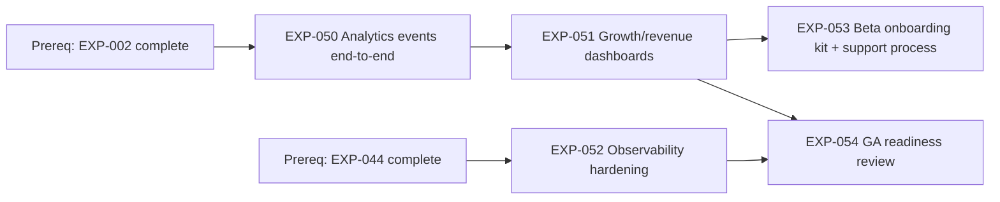

# Sprint 6 Roadmap — EXP-050..054 (Analytics, Beta Launch, Operations)

**Date:** 2026-03-10  
**Scope:** `EXP-050`, `EXP-051`, `EXP-052`, `EXP-053`, `EXP-054`

## 1) Dependency Graph

**Parallel tracks:**
- Track A (analytics): `EXP-050` → `EXP-051`
- Track O (ops): `EXP-052`
- Track B (beta ops): `EXP-053` starts after `EXP-051`
- Track G (go/no-go): `EXP-054` starts after `EXP-051` and `EXP-052`

## 2) Critical Path

**Critical path (sprint exit):** `EXP-050` → `EXP-051` → `EXP-054`

**Why:** GA decision quality depends on reliable KPI instrumentation and dashboards; without those, `EXP-054` cannot be credible even if ops work lands.

**Secondary risk path:** `EXP-052` → `EXP-054`

**Top bottlenecks:**
- Event taxonomy churn in `EXP-050` causes dashboard rework in `EXP-051`.
- Alert noise/missing runbook steps in `EXP-052` can block `EXP-054` signoff.
- Late KPI definition changes from PM create metric mismatch at decision time.

## 3) Assignment Model (2–4 engineers)

## Recommended baseline (3 engineers)

| Engineer | Primary Ownership | Secondary/Support |
|---|---|---|
| E1 (FS) | `EXP-050`, `EXP-051` | Support KPI validation in `EXP-054` |
| E2 (OPS/BE) | `EXP-052` | Pair with E1 on telemetry/alert wiring |
| E3 (PM/FE) | `EXP-053`, `EXP-054` | Own launch checklist and decision packet |

## If only 2 engineers

| Engineer | Ownership |
|---|---|
| E1 (FS/BE) | `EXP-050`, `EXP-051`, technical inputs for `EXP-054` |
| E2 (OPS/PM) | `EXP-052`, `EXP-053`, facilitation of `EXP-054` |

**Scope control:** keep `EXP-053` to minimal onboarding kit (invite email template, quickstart, escalation path).

## If 4 engineers

| Engineer | Ownership |
|---|---|
| E1 (FS) | `EXP-050` |
| E2 (FS/PM) | `EXP-051` |
| E3 (OPS) | `EXP-052` |
| E4 (PM/Support) | `EXP-053`, `EXP-054` prep |

## 4) Decision Gates / Checkpoints

| Day | Gate | Go/No-Go Criteria | Risk if Fails | Immediate Action |
|---|---|---|---|---|
| D2 | Event Contract Gate | `EXP-050` event list + property schema frozen | Rework across `EXP-051` and KPI tracking | Freeze schema; route all changes through PM+FS signoff |
| D4 | Dashboard Accuracy Gate | `EXP-051` reflects baseline KPI values from seeded/real flows | Invalid GA inputs | Pause new charts; fix source event mapping first |
| D6 | Observability Gate | `EXP-052` alerts fire correctly and runbook tested in drill | Operational blind spots | Shift 1 engineer to alert tuning/runbook hardening |
| D8 | Beta Readiness Gate | `EXP-053` onboarding + support path tested with dry-run cohort | Beta friction/support overload | Trim docs polish, close onboarding gaps only |
| D10 | Launch Decision Gate | `EXP-054` packet complete: KPIs, incident posture, recommendation | No defensible launch call | Produce explicit remedial plan + revised launch date |

## 5) 10-Working-Day Schedule

| Day | Plan | Output |
|---|---|---|
| 1 | Kickoff, finalize KPI dictionary, agree event taxonomy + gate criteria | Locked acceptance criteria + risk log |
| 2 | Implement core events for key user journeys (`EXP-050`) | Event contracts frozen |
| 3 | Complete remaining instrumentation + validation queries | End-to-end event coverage report |
| 4 | Build dashboards (`EXP-051`) using validated events | First KPI dashboard version |
| 5 | Harden dashboard correctness + PM signoff on KPI definitions | Dashboard v1 approved |
| 6 | Execute observability hardening (`EXP-052`): alerts, thresholds, runbook drill | Alerting + runbook operational |
| 7 | Fix drill findings; stabilize telemetry/alerts | Ops readiness checklist green |
| 8 | Deliver beta onboarding kit/support workflow (`EXP-053`) + dry run | Beta runbook ready |
| 9 | Prepare GA decision packet (`EXP-054`) with KPI trends + incident posture | Decision pre-read complete |
| 10 | Decision review, go/no-go call, carryover cutline | Signed launch decision + action list |

**Daily control rules:**
- [ ] No event-schema breaking changes after D2 without explicit signoff.
- [ ] Critical-path PRs (`050/051/054`) reviewed within 24h.
- [ ] Alert/rule changes require same-day drill replay evidence.
- [ ] Any slip on `EXP-050` or `EXP-051` triggers immediate de-scope of non-critical `EXP-053` polish.
