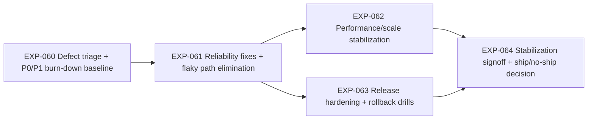

# Sprint 7 Roadmap — EXP-060..064 (Stabilization Sprint)

**Date:** 2026-03-10  
**Scope:** `EXP-060`, `EXP-061`, `EXP-062`, `EXP-063`, `EXP-064`

## 1) Dependency Graph

**Parallel tracks:**
- Track F (fixes): `EXP-060` → `EXP-061`
- Track P (perf): `EXP-062` starts after core reliability paths are stable in `EXP-061`
- Track R (release ops): `EXP-063` starts once critical fixes from `EXP-061` are merged
- Track S (signoff): `EXP-064` starts after `EXP-062` and `EXP-063`

## 2) Critical Path

**Critical path (sprint exit):** `EXP-060` → `EXP-061` → `EXP-063` → `EXP-064`

**Why:** release decision (`EXP-064`) is blocked by both functional stability and proven rollback/recovery readiness.

**Secondary risk path:** `EXP-061` → `EXP-062` → `EXP-064`

**Top bottlenecks:**
- Late re-prioritization in `EXP-060` delays all downstream work.
- Unstable flaky tests in `EXP-061` create false confidence and block RC quality.
- Incomplete rollback drill evidence in `EXP-063` prevents defensible signoff.

## 3) Assignment Model (2–4 engineers)

## Recommended baseline (3 engineers)

| Engineer | Primary Ownership | Secondary/Support |
|---|---|---|
| E1 (FS/BE) | `EXP-060`, `EXP-061` | Support incident fixes discovered in `EXP-063` |
| E2 (FS/Perf) | `EXP-062` | Pair with E1 on high-latency paths |
| E3 (QA/Ops) | `EXP-063`, `EXP-064` | Own release checklist, rollback drill evidence, signoff packet |

## If only 2 engineers

| Engineer | Ownership |
|---|---|
| E1 (FS/BE) | `EXP-060`, `EXP-061`, critical hot paths in `EXP-062` |
| E2 (QA/Ops/FE) | `EXP-063`, `EXP-064`, targeted regression verification |

**Scope control:** keep `EXP-062` to top 2 user-facing hot paths if schedule slips.

## If 4 engineers

| Engineer | Ownership |
|---|---|
| E1 (FS/BE) | `EXP-060` |
| E2 (FS/BE) | `EXP-061` |
| E3 (Perf) | `EXP-062` |
| E4 (QA/Ops) | `EXP-063`, `EXP-064` |

## 4) Decision Gates / Checkpoints

| Day | Gate | Go/No-Go Criteria | Risk if Fails | Immediate Action |
|---|---|---|---|---|
| D2 | Stabilization Scope Gate | `EXP-060` backlog frozen with P0/P1 labels and owners | Thrash; no predictable sprint flow | Freeze new non-critical issues; route new reports through triage board only |
| D4 | Reliability Gate | `EXP-061` closes all P0 defects and flakes on critical flows | RC quality invalid | Reassign all engineers to P0/P1 bugfix mode |
| D6 | Performance Gate | `EXP-062` meets agreed response-time budgets on hot paths | User-facing instability at launch | Cut low-value optimizations; focus only on budget misses |
| D8 | Release Drill Gate | `EXP-063` rollback + recovery drill passes with timed evidence | High release risk | Repeat drill same day after fix; block feature merges |
| D10 | Ship Decision Gate | `EXP-064` packet complete: defect trend, perf budgets, rollback readiness | No defensible ship/no-ship call | Publish explicit no-ship remediation plan with revised date |

## 5) 10-Working-Day Schedule

| Day | Plan | Output |
|---|---|---|
| 1 | Kickoff, define stabilization targets, create triage board and ownership map | Locked goals + risk register |
| 2 | Execute `EXP-060` triage and freeze sprint defect scope | Prioritized P0/P1 queue with owners |
| 3 | Deliver first reliability fix wave for `EXP-061` (critical journeys first) | P0 burn-down trend + RC candidate A |
| 4 | Complete core `EXP-061` fixes, remove top flaky tests, rerun targeted regressions | Reliability gate evidence |
| 5 | Start `EXP-062` hot-path profiling and optimization | Baseline perf report + top bottleneck list |
| 6 | Complete `EXP-062` budget fixes and validate against thresholds | Perf gate evidence |
| 7 | Begin `EXP-063` release hardening: runbook updates + rollback rehearsal prep | Release checklist v1 |
| 8 | Execute rollback/recovery drills and close drill findings (`EXP-063`) | Drill pass report + corrected runbook |
| 9 | Assemble `EXP-064` signoff packet and run final targeted regression | Ship/no-ship pre-read |
| 10 | Decision review, ship/no-ship call, carryover and remediation plan | Signed decision + next actions |

## 6) Control Checklist (Daily)

- [ ] No new feature scope enters Sprint 7 after D2.
- [ ] All P0 issues have owner + ETA by end of each day.
- [ ] Critical-path PRs (`060/061/063/064`) reviewed within 24h.
- [ ] Regression rerun after each P0 fix merge on affected flow.
- [ ] Any D4 or D8 miss triggers immediate bugfix-only mode.
